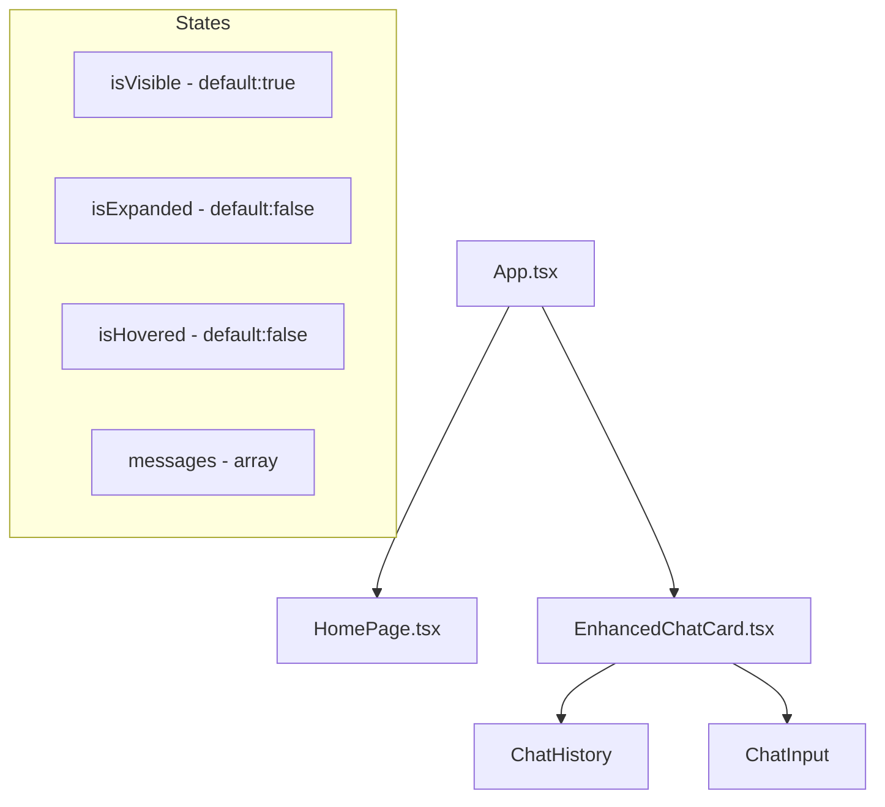
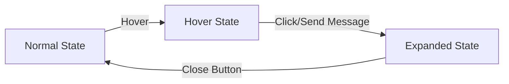
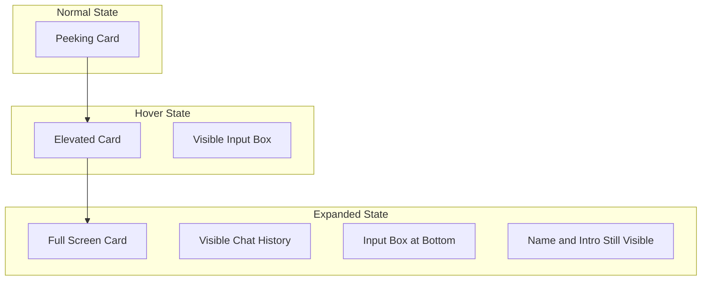

# Portfolio Chat Interface Implementation Plan

Based on my analysis of the current website and the requested features, I'll develop a detailed plan to implement a chat interface that mimics the design shown in the reference image while adding the requested animated behaviors.

## Current Website Analysis

The current portfolio website has:

1. A clean, minimalist design with a light cream background (#faf8f2)
2. A header with name "Derek Gagnon" and a brief introduction
3. A circular profile image with overlay effects
4. Social media icons for connecting with the user
5. A projects section that can be toggled via a button
6. An existing but unused `ChatBubble.tsx` component

## Design & Functionality Requirements

Based on your request, we need to implement:

1. A peeking, rounded-corner card at the bottom of the page
2. Hover interaction that slightly elevates the card to fully reveal a text input box
3. After first message, the card expands upward to fill most of the screen
4. The expanded chat keeps name and intro visible but covers the central image

## Implementation Plan

### 1. Component Structure & State Management



### 2. CSS & Animation Strategy



1. **Normal State**: Card peeks from bottom with rounded corners, partial view
2. **Hover State**: Card elevates slightly showing full input box
3. **Expanded State**: Card covers central content but keeps header visible

### 3. Technical Implementation Details

#### 3.1 Enhanced Chat Component Modifications

1. Create a new `EnhancedChatCard.tsx` component based on the existing `ChatBubble.tsx` but with the following modifications:

```typescript
// Key state variables
const [isHovered, setIsHovered] = useState(false);
const [isExpanded, setIsExpanded] = useState(false);
const [hasMessages, setHasMessages] = useState(false);
```

2. Implement position and transition CSS:
   - Use fixed positioning at the bottom of the screen
   - Apply rounded corners and proper shadows
   - Set up CSS transitions for smooth animations

#### 3.2 Interaction Behaviors

1. **Hover Effect**:
   ```typescript
   <div 
     onMouseEnter={() => setIsHovered(true)}
     onMouseLeave={() => setIsHovered(false)}
     className={`chat-card ${isHovered ? 'chat-card-hovered' : ''}`}
   >
   ```

2. **Message Sending Expansion**:
   ```typescript
   const handleSubmit = (message) => {
     // Add message to chat
     setMessages([...messages, message]);
     
     // If this is the first message, trigger expansion
     if (!hasMessages) {
       setIsExpanded(true);
       setHasMessages(true);
     }
   }
   ```

3. **Styling classes for different states**:
   ```css
   .chat-card {
     /* Base styles */
     transform: translateY(70%);
     transition: transform 0.3s ease, height 0.5s ease;
   }
   
   .chat-card-hovered {
     transform: translateY(10%);
   }
   
   .chat-card-expanded {
     height: 80vh;
     transform: translateY(0);
   }
   ```

#### 3.3 CSS Overlay Strategy

1. Use z-index to ensure the chat component appears above other content when expanded
2. Apply backdrop filters for a subtle background effect
3. Implement responsive sizing based on viewport height

### 4. Integration with Existing App

1. Add the enhanced chat component to `App.tsx`
2. Ensure z-index values are appropriately set to control layering
3. Implement responsive design considerations for different screen sizes

### 5. Animation Timing & Smoothness

1. Use CSS transitions for smooth animations between states
2. Set appropriate timing functions and durations:
   - Hover animation: 0.3s
   - Expansion animation: 0.5s 
   - Message appearance: 0.3s with slight delay

### 6. Testing Strategy

1. Test on different viewport sizes to ensure responsive behavior
2. Verify all animations work correctly
3. Test edge cases (rapid interaction, multiple messages, etc.)

## Visual Representation



## Implementation Steps

1. Create the enhanced chat component with base styling
2. Implement hover state animations
3. Add expansion functionality triggered by first message
4. Style the component for all three states
5. Test and refine animations and responsiveness
6. Integrate with the main app and ensure it works with existing components

## CSS Implementation Details

### Main Chat Card Container

```css
.chat-card {
  position: fixed;
  bottom: 0;
  left: 0;
  right: 0;
  margin: 0 auto;
  width: 90%;
  max-width: 800px;
  background-color: white;
  border-radius: 16px 16px 0 0;
  box-shadow: 0 -4px 20px rgba(0, 0, 0, 0.1);
  transform: translateY(85%);
  transition: transform 0.3s ease, height 0.5s ease;
  overflow: hidden;
  z-index: 50;
}

.chat-card-hovered {
  transform: translateY(65%);
}

.chat-card-expanded {
  height: 80vh;
  transform: translateY(0);
}
```

### Chat Header

```css
.chat-header {
  padding: 16px;
  background-color: var(--color-pink);
  color: white;
  border-radius: 16px 16px 0 0;
  cursor: pointer;
}
```

### Chat Content Area

```css
.chat-content {
  height: 100%;
  display: flex;
  flex-direction: column;
  transition: opacity 0.3s ease;
}

.chat-history {
  flex: 1;
  overflow-y: auto;
  padding: 16px;
}

.chat-input-container {
  padding: 16px;
  border-top: 1px solid rgba(0, 0, 0, 0.1);
}
```

## JavaScript Animation Logic

```javascript
// On hover
const handleMouseEnter = () => {
  if (!isExpanded) {
    setIsHovered(true);
  }
};

const handleMouseLeave = () => {
  if (!isExpanded) {
    setIsHovered(false);
  }
};

// On message send
const handleSendMessage = () => {
  // Add message logic here
  
  // If this is the first message
  if (messages.length === 1) {
    setIsExpanded(true);
  }
};

// Class name logic
const cardClassName = `chat-card ${isHovered ? 'chat-card-hovered' : ''} ${isExpanded ? 'chat-card-expanded' : ''}`;