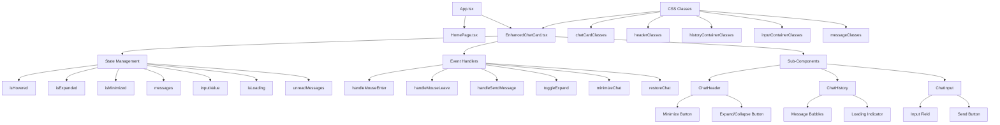

# Chat Interface Implementation Summary

This document provides a comprehensive summary of the implementation plan for the enhanced chat interface on the portfolio website.

## Overview of Implementation Documents

1. **[chat-interface-implementation-plan.md](./chat-interface-implementation-plan.md)** - Main implementation plan with component structure, CSS strategy, and key features
2. **[chat-card-technical-implementation.md](./chat-card-technical-implementation.md)** - Technical details of the implementation including component code, CSS classes, and state management
3. **[chat-card-technical-implementation-updated.md](./chat-card-technical-implementation-updated.md)** - Updated implementation including the minimize feature
4. **[chat-interface-visual-mockup.md](./chat-interface-visual-mockup.md)** - Visual representation of different states of the chat interface

## Component and Data Flow Diagram

## Key Features Summary

1. **Peek, Hover, Expand Behavior**
   - Initially shows a peeking card at the bottom of the page
   - On hover, card elevates to reveal the full input box
   - On first message, expands to fill most of the screen

2. **Minimize Functionality (Added Feature)**
   - Allows users to minimize the expanded chat without losing context
   - Shows an indicator for unread messages while minimized
   - Provides a smooth way to restore the chat to expanded state

3. **Responsive Design**
   - Adapts to different screen sizes
   - Maintains usability on mobile, tablet, and desktop
   - Adjusts size proportions based on viewport

4. **Animation and Transitions**
   - Smooth transitions between states
   - Bounce-in effects for expansion
   - Fade-in effects for new messages

## Implementation Timeline

| Phase | Task | Estimated Time |
|-------|------|---------------|
| 1 | Create component structure and base styling | 2-3 hours |
| 2 | Implement hover animation and peek functionality | 1-2 hours |
| 3 | Implement expansion on first message | 2 hours |
| 4 | Add minimize functionality | 2 hours |
| 5 | Implement chat history and message functionality | 2-3 hours |
| 6 | Testing and responsive design adjustments | 2-3 hours |
| **Total** | | **11-15 hours** |

## Technical Challenges and Solutions

### 1. Preserving Content Visibility

**Challenge:** Expanding the chat interface while keeping the header content visible

**Solution:** 
- Position the chat card absolutely with a high z-index
- Ensure the card expands from the bottom, preserving top content
- Add appropriate overflow handling

### 2. Animation Performance

**Challenge:** Ensuring smooth animations, especially on mobile devices

**Solution:**
- Use CSS transforms instead of animating dimensions directly
- Use `will-change` property for elements that will animate
- Test on various devices and optimize as needed

### 3. State Management Complexity

**Challenge:** Managing multiple states (peeking, hovered, expanded, minimized)

**Solution:**
- Create clear state variables with descriptive names
- Implement state transitions with clear logic
- Use effect hooks to handle side effects of state changes

### 4. Responsive Design

**Challenge:** Making the interface work well on all screen sizes

**Solution:**
- Use percentage and viewport-based units for sizing
- Implement different layouts for different breakpoints
- Test on various screen sizes

## Code Migration Strategy

1. Create the new `EnhancedChatCard.tsx` component
2. Add necessary CSS to `main.css`
3. Import and integrate the component in `App.tsx`
4. Test and refine the implementation

## Testing Checklist

- [ ] Test hover interaction on desktop
- [ ] Test touch interaction on mobile
- [ ] Verify expansion on first message
- [ ] Test minimize functionality
- [ ] Verify message scrolling
- [ ] Test on different browsers (Chrome, Firefox, Safari)
- [ ] Test on different devices (desktop, tablet, mobile)
- [ ] Verify performance of animations
- [ ] Test edge cases (rapid interaction, many messages)

## Conclusion

The implementation plan provides a comprehensive approach to creating an enhanced chat interface for the portfolio website. By following this plan, the chat interface will be implemented with all the requested features, including the added minimize functionality, while ensuring good performance and responsive design.

The interface will mimic the design shown in the reference image while adding the requested animated behaviors, creating an engaging and interactive experience for users of the portfolio site.