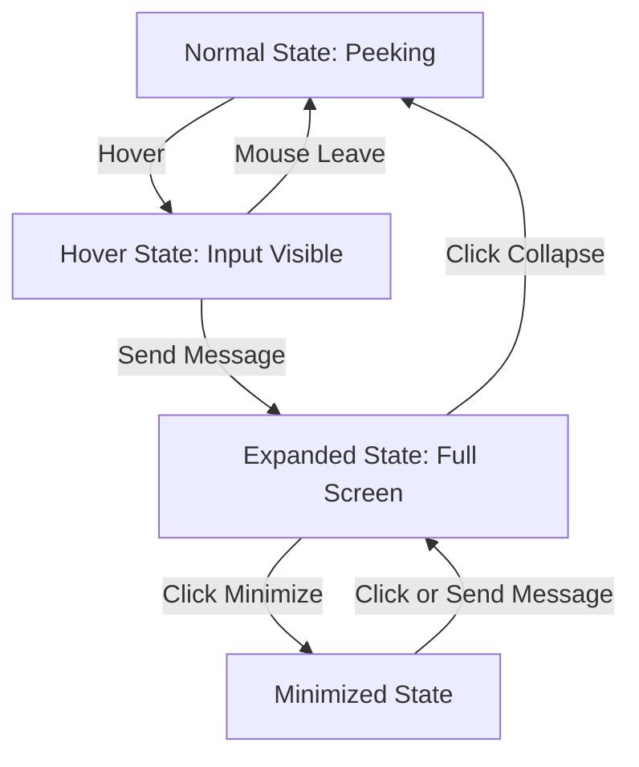

# Chat Interface Visual Mockup

This document provides a visual representation of the different states of the enhanced chat interface.

## State Transitions



## Visual States Mockup

### 1. Normal State (Peeking)
```
┌───────────────────────────────────────────────────┐
│                                                   │
│                                                   │
│                                                   │
│          [Derek Gagnon - Header Content]          │
│                                                   │
│                                                   │
│                                                   │
│                                                   │
│                                                   │
│                 [Profile Image]                   │
│                                                   │
│                                                   │
│                                                   │
│                                                   │
│                                                   │
│                                                   │
│                                                   │
│                                                   │
│                                                   │
│                                                   │
├───────────────────────────────────────────────────┤
│ Chat with me                                   ▲  │
└───────────────────────────────────────────────────┘
```

### 2. Hover State (Input Visible)
```
┌───────────────────────────────────────────────────┐
│                                                   │
│                                                   │
│                                                   │
│          [Derek Gagnon - Header Content]          │
│                                                   │
│                                                   │
│                                                   │
│                                                   │
│                                                   │
│                 [Profile Image]                   │
│                                                   │
│                                                   │
│                                                   │
│                                                   │
│                                                   │
│                                                   │
│                                                   │
├───────────────────────────────────────────────────┤
│ Chat with me                                   ▼  │
├───────────────────────────────────────────────────┤
│ ┌─────────────────────────────────────────┐ ┌───┐ │
│ │ Ask me about my experience...           │ │ → │ │
│ └─────────────────────────────────────────┘ └───┘ │
└───────────────────────────────────────────────────┘
```

### 3. Expanded State (Full Screen)
```
┌───────────────────────────────────────────────────┐
│                                                   │
│          [Derek Gagnon - Header Content]          │
│                                                   │
├───────────────────────────────────────────────────┤
│ Chat with me                               ─  ▼  │
├───────────────────────────────────────────────────┤
│                                                   │
│  ┌────────────────────────────────────────────┐   │
│  │ Hello! I can answer questions about my     │   │
│  │ experience in medical device engineering.  │   │
│  │ What would you like to know?               │   │
│  └────────────────────────────────────────────┘   │
│                                                   │
│                                                   │
│                 [Chat History]                    │
│                                                   │
│                                                   │
│                                                   │
│                                                   │
│                                                   │
├───────────────────────────────────────────────────┤
│ ┌─────────────────────────────────────────┐ ┌───┐ │
│ │ Ask me about my experience...           │ │ → │ │
│ └─────────────────────────────────────────┘ └───┘ │
└───────────────────────────────────────────────────┘
```

### 4. Minimized State (Added Feature)
```
┌───────────────────────────────────────────────────┐
│                                                   │
│                                                   │
│                                                   │
│          [Derek Gagnon - Header Content]          │
│                                                   │
│                                                   │
│                                                   │
│                                                   │
│                                                   │
│                 [Profile Image]                   │
│                                                   │
│                                                   │
│                                                   │
│                                                   │
│                                                   │
│                                                   │
│                                                   │
│                                                   │
│                                                   │
│                                                   │
├───────────────────────────────────────────────────┤
│ Chat with me                     [1] unread    ▲  │
└───────────────────────────────────────────────────┘
```

## Component Details

### Chat Card Header
```
┌───────────────────────────────────────────────────┐
│ Chat with me                               ─  ▼  │
└───────────────────────────────────────────────────┘
```
- Title: "Chat with me"
- Minimize button: "─" (only visible in expanded state)
- Expand/Collapse button: "▲" or "▼" depending on state

### Chat Messages
```
┌────────────────────────────────────────────┐
│ Hello! I can answer questions about my     │
│ experience in medical device engineering.  │
│ What would you like to know?               │
└────────────────────────────────────────────┘

                                  ┌──────────────┐
                                  │ User message │
                                  └──────────────┘
```
- Bot messages: Left-aligned, cream background with dark text
- User messages: Right-aligned, pink background with white text

### Chat Input
```
┌─────────────────────────────────────────┐ ┌───┐
│ Ask me about my experience...           │ │ → │
└─────────────────────────────────────────┘ └───┘
```
- Text input field with placeholder
- Send button with arrow icon

## Animation and Transition Notes

1. **Peeking to Hover**: 
   - Smooth transition sliding upward
   - Duration: 0.3s
   - Timing function: ease-in-out

2. **Hover to Expanded**:
   - Triggered by first message
   - Grow animation from bottom
   - Duration: 0.5s
   - Timing function: ease-out

3. **Expanded to Minimized**:
   - Triggered by minimize button
   - Slide down animation
   - Duration: 0.3s
   - Timing function: ease-in-out

4. **Minimized to Expanded**:
   - Triggered by clicking on minimized chat or input field
   - Slide up animation
   - Duration: 0.3s
   - Timing function: ease-out

## Responsive Design Notes

- On mobile devices:
  - Card width: 95% of viewport width
  - Expanded height: 85% of viewport height
  - Font sizes adjusted for readability

- On tablets:
  - Card width: 90% of viewport width
  - Expanded height: 80% of viewport height

- On desktops:
  - Card width: 75% of viewport width (max-width: 800px)
  - Expanded height: 70% of viewport height