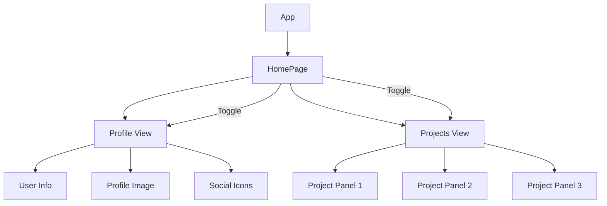

# Portfolio Redesign Implementation Plan

## Overview

This plan outlines the steps to redesign the portfolio main page to match the minimalist design in the reference image while implementing a toggle functionality for projects display.

## Design Requirements

Based on the reference image, we need to implement:

1. **Visual Design**:
   - Minimalist approach with "white space" and minimal use of hard lines
   - Relaxing, contrasting colors that are easy on the eyes
   - Cream/off-white background with subtle pink accents
   - Circular profile picture with unique styling (dark background with pink accent)
   - Clean typography with clear hierarchy

2. **Layout**:
   - Logo/name in top left
   - Blog link in top right
   - Two-column layout with profile info and image
   - Centered content
   - Social media icons at the bottom left

3. **Functionality**:
   - Toggle between profile view and projects view
   - Projects should be hidden initially
   - Projects should appear in a centered container when toggled
   - Projects should replace the graphical elements when displayed

## Component Structure



## Implementation Details

### 1. Update Color Scheme and Styles

#### Update Tailwind Configuration

Modify the `tailwind.config.js` file to include new color variables:

```javascript
module.exports = {
  content: [
    './client/**/*.{js,jsx,ts,tsx}',
    './client/index.html'
  ],
  theme: {
    extend: {
      colors: {
        cream: '#f5f0e8', // Base background color
        darkGray: '#333333', // Text and dark accents
        pink: '#ff9ebf', // Accent color
        navyText: '#333333', // Text color for headings
      }
    },
  },
  plugins: [],
}
```

#### Update Main CSS

Update `client/styles/main.css` to include new custom variables and styles:

```css
@tailwind base;
@tailwind components;
@tailwind utilities;

/* Custom styles */
:root {
  --color-cream: #f5f0e8;
  --color-dark-gray: #333333;
  --color-pink: #ff9ebf;
  --color-navy-text: #333333;
}

body {
  background-color: var(--color-cream);
  color: var(--color-dark-gray);
}

.profile-image-container {
  position: relative;
  width: 280px;
  height: 280px;
}

.profile-image-outline {
  position: absolute;
  width: 100%;
  height: 100%;
  border-radius: 50%;
  background: var(--color-dark-gray);
  z-index: 0;
}

.profile-image-accent {
  position: absolute;
  width: 100%;
  height: 100%;
  border-radius: 50%;
  background: var(--color-pink);
  left: 10px;
  top: -10px;
  z-index: 1;
}

.profile-image {
  position: absolute;
  width: 90%;
  height: 90%;
  object-fit: cover;
  border-radius: 50%;
  top: 5%;
  left: 5%;
  z-index: 2;
}

/* Button and card styles */
@layer components {
  .btn-primary {
    @apply px-4 py-2 bg-darkGray text-white rounded-full hover:opacity-90 transition-opacity;
  }
  
  .btn-secondary {
    @apply px-4 py-2 border border-pink text-darkGray rounded-full hover:bg-pink hover:text-white transition-colors;
  }

  .social-icon {
    @apply w-6 h-6 text-darkGray hover:text-pink transition-colors;
  }
}
```

### 2. Modify App Component

Update `client/components/App.tsx` to use the new design:

```typescript
import React from 'react';
import HomePage from '../pages/HomePage.tsx';

const App: React.FC = () => {
  return (
    <div className="min-h-screen bg-cream text-darkGray">
      <main className="container mx-auto p-8 max-w-6xl">
        <div className="flex justify-between items-center mb-16">
          <div className="flex items-center">
            <div className="w-8 h-8 bg-darkGray rounded-full mr-2"></div>
            <span className="font-medium text-sm uppercase tracking-wide">Derek Gagnon</span>
          </div>
          <a href="#" className="text-sm font-medium hover:text-pink transition-colors">→ BLOG</a>
        </div>
        <HomePage />
      </main>
    </div>
  );
};

export default App;
```

### 3. Update HomePage Component

Modify `client/pages/HomePage.tsx` to implement the new layout and toggle functionality:

```typescript
import React, { useState } from 'react';
import ProjectPanel from '../components/ProjectPanel.tsx';

const HomePage: React.FC = () => {
  const [showProjects, setShowProjects] = useState(false);
  
  const projects = [
    {
      title: "Cardiac Monitoring Device",
      description: "Developed a next-gen cardiac monitoring system",
      imageUrl: "data:image/svg+xml,%3Csvg width='400' height='300' xmlns='http://www.w3.org/2000/svg'%3E%3Crect width='400' height='300' fill='%230a192f'/%3E%3Ctext x='50%25' y='50%25' font-family='Arial' font-size='24' fill='white' text-anchor='middle'%3ECardiac Monitoring Device%3C/text%3E%3Cpath d='M100,150 L150,100 L200,150 L250,100 L300,150' stroke='red' stroke-width='4' fill='none'/%3E%3C/svg%3E",
      details: "Led the development of a Class II medical device for continuous cardiac monitoring. Implemented quality management systems compliant with ISO 13485 and FDA regulations. Designed and validated the device through clinical trials.",
    },
    {
      title: "Drug Delivery System",
      description: "Innovative drug delivery mechanism",
      imageUrl: "data:image/svg+xml,%3Csvg width='400' height='300' xmlns='http://www.w3.org/2000/svg'%3E%3Crect width='400' height='300' fill='%230a192f'/%3E%3Ctext x='50%25' y='50%25' font-family='Arial' font-size='24' fill='white' text-anchor='middle'%3EDrug Delivery System%3C/text%3E%3Cpath d='M150,100 L150,200 M100,150 L200,150' stroke='white' stroke-width='4' fill='none'/%3E%3Ccircle cx='250' cy='150' r='50' fill='none' stroke='white' stroke-width='4'/%3E%3C/svg%3E",
      details: "Designed and implemented a novel drug delivery system with precise dosage control. Conducted risk analysis using FMEA methodology and implemented risk mitigation strategies. Collaborated with regulatory experts to ensure compliance with applicable standards.",
    },
    {
      title: "Implantable Sensor",
      description: "Miniaturized sensor for real-time monitoring",
      imageUrl: "data:image/svg+xml,%3Csvg width='400' height='300' xmlns='http://www.w3.org/2000/svg'%3E%3Crect width='400' height='300' fill='%230a192f'/%3E%3Ctext x='50%25' y='50%25' font-family='Arial' font-size='24' fill='white' text-anchor='middle'%3EImplantable Sensor%3C/text%3E%3Ccircle cx='200' cy='150' r='70' fill='none' stroke='%2300ffff' stroke-width='4'/%3E%3Ccircle cx='200' cy='150' r='40' fill='none' stroke='%2300ffff' stroke-width='2'/%3E%3C/svg%3E",
      details: "Developed a miniaturized implantable sensor for real-time patient monitoring. Optimized power consumption and wireless data transmission capabilities. Conducted biocompatibility testing and long-term stability studies.",
    }
  ];

  return (
    <div className="mx-auto">
      {!showProjects ? (
        // Profile View
        <div className="grid grid-cols-1 md:grid-cols-2 gap-16 items-center">
          <div className="order-2 md:order-1">
            <h2 className="text-4xl font-bold mb-2 text-navyText">Derek Gagnon</h2>
            <p className="text-gray-500 mb-8">(yes, it's a mouthful)</p>
            
            <p className="mb-8 text-lg">
              I'm a freelance medical device engineer specializing in regulatory compliance and embedded systems design.
            </p>
            
            <button
              onClick={() => setShowProjects(true)}
              className="btn-secondary mb-12"
            >
              View Projects
            </button>
            
            <div className="flex space-x-4">
              {/* Social media icons */}
              <a href="#" className="social-icon">
                <svg xmlns="http://www.w3.org/2000/svg" viewBox="0 0 24 24" fill="currentColor">
                  <path d="M8.29 20.251c7.547 0 11.675-6.253 11.675-11.675 0-.178 0-.355-.012-.53A8.348 8.348 0 0022 5.92a8.19 8.19 0 01-2.357.646 4.118 4.118 0 001.804-2.27 8.224 8.224 0 01-2.605.996 4.107 4.107 0 00-6.993 3.743 11.65 11.65 0 01-8.457-4.287 4.106 4.106 0 001.27 5.477A4.072 4.072 0 012.8 9.713v.052a4.105 4.105 0 003.292 4.022 4.095 4.095 0 01-1.853.07 4.108 4.108 0 003.834 2.85A8.233 8.233 0 012 18.407a11.616 11.616 0 006.29 1.84" />
                </svg>
              </a>
              <a href="#" className="social-icon">
                <svg xmlns="http://www.w3.org/2000/svg" viewBox="0 0 24 24" fill="currentColor">
                  <path d="M6.94 5a2 2 0 1 1-4-.002 2 2 0 0 1 4 .002zM7 8.48H3V21h4V8.48zm6.32 0H9.34V21h3.94v-6.57c0-3.66 4.77-4 4.77 0V21H22v-7.93c0-6.17-7.06-5.94-8.72-2.91l.04-1.68z" />
                </svg>
              </a>
              <a href="#" className="social-icon">
                <svg xmlns="http://www.w3.org/2000/svg" viewBox="0 0 24 24" fill="currentColor">
                  <path d="M12 2.163c3.204 0 3.584.012 4.85.07 3.252.148 4.771 1.691 4.919 4.919.058 1.265.069 1.645.069 4.849 0 3.205-.012 3.584-.069 4.849-.149 3.225-1.664 4.771-4.919 4.919-1.266.058-1.644.07-4.85.07-3.204 0-3.584-.012-4.849-.07-3.26-.149-4.771-1.699-4.919-4.92-.058-1.265-.07-1.644-.07-4.849 0-3.204.013-3.583.07-4.849.149-3.227 1.664-4.771 4.919-4.919 1.266-.057 1.645-.069 4.849-.069zm0-2.163c-3.259 0-3.667.014-4.947.072-4.358.2-6.78 2.618-6.98 6.98-.059 1.281-.073 1.689-.073 4.948 0 3.259.014 3.668.072 4.948.2 4.358 2.618 6.78 6.98 6.98 1.281.058 1.689.072 4.948.072 3.259 0 3.668-.014 4.948-.072 4.354-.2 6.782-2.618 6.979-6.98.059-1.28.073-1.689.073-4.948 0-3.259-.014-3.667-.072-4.947-.196-4.354-2.617-6.78-6.979-6.98-1.281-.059-1.69-.073-4.949-.073zm0 5.838c-3.403 0-6.162 2.759-6.162 6.162s2.759 6.163 6.162 6.163 6.162-2.759 6.162-6.163c0-3.403-2.759-6.162-6.162-6.162zm0 10.162c-2.209 0-4-1.79-4-4 0-2.209 1.791-4 4-4s4 1.791 4 4c0 2.21-1.791 4-4 4zm6.406-11.845c-.796 0-1.441.645-1.441 1.44s.645 1.44 1.441 1.44c.795 0 1.439-.645 1.439-1.44s-.644-1.44-1.439-1.44z" />
                </svg>
              </a>
              <a href="#" className="social-icon">
                <svg xmlns="http://www.w3.org/2000/svg" viewBox="0 0 24 24" fill="currentColor">
                  <path d="M12 0c-6.626 0-12 5.373-12 12 0 5.302 3.438 9.8 8.207 11.387.599.111.793-.261.793-.577v-2.234c-3.338.726-4.033-1.416-4.033-1.416-.546-1.387-1.333-1.756-1.333-1.756-1.089-.745.083-.729.083-.729 1.205.084 1.839 1.237 1.839 1.237 1.07 1.834 2.807 1.304 3.492.997.107-.775.418-1.305.762-1.604-2.665-.305-5.467-1.334-5.467-5.931 0-1.311.469-2.381 1.236-3.221-.124-.303-.535-1.524.117-3.176 0 0 1.008-.322 3.301 1.23.957-.266 1.983-.399 3.003-.404 1.02.005 2.047.138 3.006.404 2.291-1.552 3.297-1.23 3.297-1.23.653 1.653.242 2.874.118 3.176.77.84 1.235 1.911 1.235 3.221 0 4.609-2.807 5.624-5.479 5.921.43.372.823 1.102.823 2.222v3.293c0 .319.192.694.801.576 4.765-1.589 8.199-6.086 8.199-11.386 0-6.627-5.373-12-12-12z" />
                </svg>
              </a>
            </div>
          </div>
          
          <div className="order-1 md:order-2 flex justify-center">
            <div className="profile-image-container">
              <div className="profile-image-outline"></div>
              <div className="profile-image-accent"></div>
              
            </div>
          </div>
        </div>
      ) : (
        // Projects View
        <div className="max-w-3xl mx-auto">
          <div className="flex justify-between items-center mb-8">
            <h2 className="text-3xl font-bold text-navyText">My Projects</h2>
            <button
              onClick={() => setShowProjects(false)}
              className="btn-secondary"
            >
              Back to Profile
            </button>
          </div>
          
          <div className="space-y-8">
            {projects.map((project, index) => (
              <ProjectPanel
                key={index}
                title={project.title}
                description={project.description}
                imageUrl={project.imageUrl}
                details={project.details}
              />
            ))}
          </div>
        </div>
      )}
    </div>
  );
};

export default HomePage;
```

### 4. Update ProjectPanel Component

Modify `client/components/ProjectPanel.tsx` to match the minimalist design:

```typescript
import React, { useState } from 'react';

interface ProjectPanelProps {
  title: string;
  description: string;
  imageUrl: string;
  details: string;
}

const ProjectPanel: React.FC<ProjectPanelProps> = ({ 
  title, 
  description, 
  imageUrl, 
  details 
}) => {
  const [isExpanded, setIsExpanded] = useState(false);

  return (
    <div 
      className="bg-white rounded-lg shadow-sm overflow-hidden cursor-pointer transition-all hover:shadow-md"
      onClick={() => setIsExpanded(!isExpanded)}
    >
      <div className="flex">
        <div className="w-1/3 relative">
          
        </div>
        <div className="w-2/3 p-6">
          <h3 className="text-xl font-medium mb-2">{title}</h3>
          <p className="text-gray-600 mb-2">{description}</p>
          
          {isExpanded && (
            <div className="mt-4 pt-4 border-t border-gray-100">
              <p className="text-gray-700 text-sm">{details}</p>
            </div>
          )}
        </div>
      </div>
    </div>
  );
};

export default ProjectPanel;
```

## Implementation Steps

1. **Preparation**:
   - Create backups of existing files if needed
   - Set up a development environment to test changes

2. **Execute Changes**:
   - Update `tailwind.config.js` with new color definitions
   - Modify `client/styles/main.css` with new CSS styles
   - Update `client/components/App.tsx` structure
   - Implement the new `HomePage.tsx` with toggle functionality
   - Modify `ProjectPanel.tsx` with the new design

3. **Testing**:
   - Ensure the profile view displays correctly initially
   - Test the projects toggle button functionality
   - Verify the projects view displays properly when toggled
   - Check for responsive behavior on different screen sizes
   - Test cross-browser compatibility

4. **Refinement**:
   - Adjust spacing, colors, and typography as needed
   - Fine-tune animations and transitions
   - Optimize images and SVG assets

## Testing Plan

1. **Functionality Testing**:
   - Toggle between profile and projects views
   - Expand and collapse project details
   - Check all interactive elements

2. **Visual Testing**:
   - Compare rendered page with reference design
   - Verify all design elements are properly implemented
   - Check for alignment and spacing issues

3. **Responsive Testing**:
   - Test on various screen sizes (mobile, tablet, desktop)
   - Verify layout adaptations work correctly

4. **Performance Testing**:
   - Check page load time
   - Verify smooth transitions and animations

5. **Cross-Browser Testing**:
   - Test on major browsers (Chrome, Firefox, Safari, Edge)
   - Ensure consistent appearance and functionality