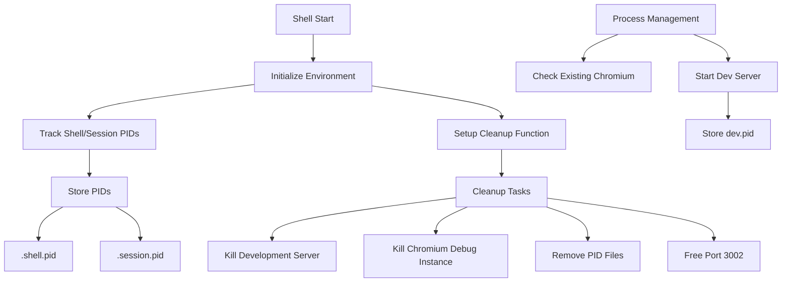

# Process Management Implementation Plan

## Overview

This plan details the improvements needed for process management in the development shell environment.



## Required Changes

### 1. PID Tracking
- Store shell PID ($$)
- Store session PID ($PPID)
- Store dev server PID
- Maintain .shell.pid, .session.pid, and .dev.pid files

### 2. Enhanced Cleanup Function
- Kill development server using stored PID
- Terminate chromium debug instance
- Remove all PID files (.shell.pid, .session.pid, .dev.pid)
- Ensure port 3002 is freed
- Add proper error handling and logging

### 3. Process Management
- Check for existing chromium debug instance before starting
- Run development server in background
- Store process PIDs for tracking
- Add status messages for better debugging

### 4. Shell Hook Implementation Structure

```bash
# Track shell and session
echo $$ > .shell.pid
echo $PPID > .session.pid

# Enhanced cleanup function
cleanup() {
  # Kill processes
  # Remove PID files
  # Free ports
}

# Set trap
trap cleanup EXIT

# Start processes with proper checks
# Store PIDs
# Show status
```

## Testing

The implementation will be verified using the test-shell-cleanup.sh script which checks:
1. PID file creation
2. Development server functionality
3. Chromium debug instance
4. Cleanup process effectiveness

## Success Criteria
- All test cases in test-shell-cleanup.sh pass
- No orphaned processes after shell exit
- All PID files properly cleaned up
- Port 3002 freed after cleanup