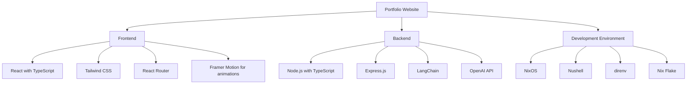
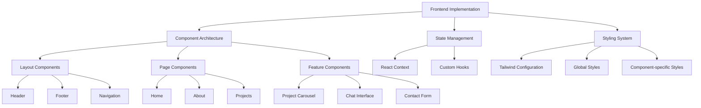
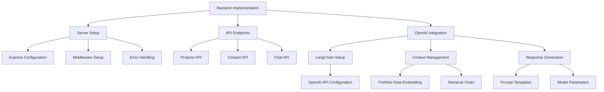
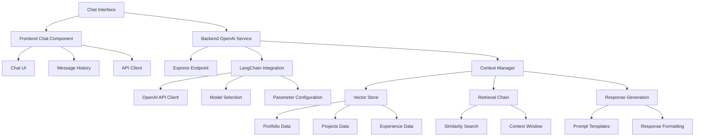

# Medical Device Engineer Portfolio Website - Implementation Plan

## Project Overview

We'll create a modern, interactive portfolio website with the following features:
- Single-page layout with a smooth navigation experience
- Interactive project showcase with dynamic presentation
- OpenAI-powered chat interface to answer questions about your experience
- Minimalist design with muted cool tones and golden brass accents
- NixOS-based development environment

## Technology Stack



## Project Structure

```
medical-device-portfolio/
├── flake.nix                  # Nix development environment
├── .envrc                     # direnv configuration
├── package.json               # Project dependencies
├── tsconfig.json              # TypeScript configuration
├── client/                    # Frontend React application
│   ├── src/
│   │   ├── components/        # Reusable UI components
│   │   ├── pages/             # Page components
│   │   ├── services/          # API client services
│   │   ├── hooks/             # Custom React hooks
│   │   ├── utils/             # Utility functions
│   │   ├── assets/            # Static assets
│   │   ├── styles/            # Global styles
│   │   ├── App.tsx            # Main application component
│   │   └── index.tsx          # Application entry point
├── server/                    # Backend Express application
│   ├── src/
│   │   ├── api/               # API routes
│   │   ├── config/            # Configuration
│   │   ├── services/          # Business logic
│   │   ├── models/            # Data models
│   │   ├── utils/             # Utility functions
│   │   ├── middleware/        # Express middleware
│   │   └── index.ts           # Server entry point
├── shared/                    # Shared TypeScript types
└── scripts/                   # Build and development scripts
```

## Implementation Plan

### Phase 1: Development Environment Setup

1. Create a Nix flake for the development environment:
   - Define development shell with all required dependencies
   - Set up TypeScript, Node.js, and other development tools
   - Configure direnv for automatic environment activation

2. Initialize the project:
   - Set up monorepo structure with client and server
   - Configure TypeScript for both frontend and backend
   - Set up ESLint and Prettier for code quality

### Phase 2: Frontend Implementation

1. Create the React application structure:
   - Set up React with TypeScript
   - Integrate Tailwind CSS
   - Configure React Router for navigation

2. Implement core components:
   - Header with navigation
   - Footer with contact information
   - About Me section
   - Project showcase component
   - Chat interface component

3. Design system implementation:
   - Define color palette based on muted cool tones and golden brass accents
   - Create typography system
   - Implement responsive layout components

4. Implement interactive features:
   - Rotating project panels
   - Animations for smooth transitions
   - Form handling for contact section



### Phase 3: Backend Implementation

1. Set up Express.js server:
   - Configure TypeScript for Node.js
   - Set up API routes
   - Implement CORS and other middleware

2. Implement API endpoints:
   - Project data endpoint
   - Contact form endpoint
   - LLM chat endpoint

3. Integrate OpenAI API with LangChain:
   - Set up OpenAI API integration
   - Create prompt templates for portfolio-specific questions
   - Implement context retrieval for accurate responses about experience and projects
   - Configure OpenAI model parameters (temperature, max tokens, etc.)



### Phase 4: Integration and Testing

1. Connect frontend and backend:
   - Implement API client services
   - Set up environment-specific configuration

2. Test the application:
   - Unit testing for components and API endpoints
   - Integration testing for frontend-backend interaction
   - End-to-end testing for critical user flows

3. Optimize performance:
   - Implement code splitting
   - Optimize images and assets
   - Configure caching

### Phase 5: Deployment Preparation

1. Build process setup:
   - Configure build scripts for frontend and backend
   - Set up production environment variables

2. Deployment options:
   - Netlify/Vercel for frontend
   - Railway/Heroku/AWS for backend
   - Environment-specific configuration

## Technical Details

### Nix Flake Configuration

Here's an overview of what the `flake.nix` file will contain:

```nix
{
  description = "Medical Device Engineer Portfolio";

  inputs = {
    nixpkgs.url = "github:NixOS/nixpkgs/nixos-unstable";
    flake-utils.url = "github:numtide/flake-utils";
    snowfall-lib = {
      url = "github:snowfall-lib/flake";
      inputs.nixpkgs.follows = "nixpkgs";
    };
  };

  outputs = { self, nixpkgs, flake-utils, snowfall-lib, ... }:
    flake-utils.lib.eachDefaultSystem (system:
      let
        pkgs = nixpkgs.legacyPackages.${system};
      in
      {
        devShell = pkgs.mkShell {
          buildInputs = with pkgs; [
            nodejs
            nodePackages.typescript
            nodePackages.typescript-language-server
            nodePackages.yarn
            nodePackages.pnpm
            nodePackages.eslint
            nodePackages.prettier
            direnv
          ];
          
          shellHook = ''
            echo "Medical Device Engineer Portfolio development environment"
            export PATH="$PWD/node_modules/.bin:$PATH"
          '';
        };
      }
    );
}
```

### OpenAI API Integration Architecture



## Timeline and Milestones

1. **Week 1**: Development environment setup and project initialization
   - Nix flake and direnv configuration
   - Project structure setup
   - Initial dependencies installation

2. **Week 2-3**: Frontend implementation
   - Component architecture
   - Pages and routing
   - Styling system
   - Basic interactions

3. **Week 4**: Backend implementation
   - Express server setup
   - API endpoints
   - Basic data handling

4. **Week 5**: OpenAI API integration
   - LangChain setup
   - Context management
   - Chat interface implementation

5. **Week 6**: Integration, testing, and optimization
   - Frontend-backend connection
   - Testing and debugging
   - Performance optimization

6. **Week 7**: Deployment and documentation
   - Build configuration
   - Deployment setup
   - Documentation